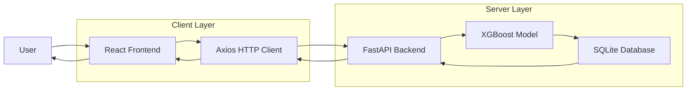
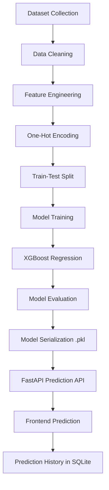
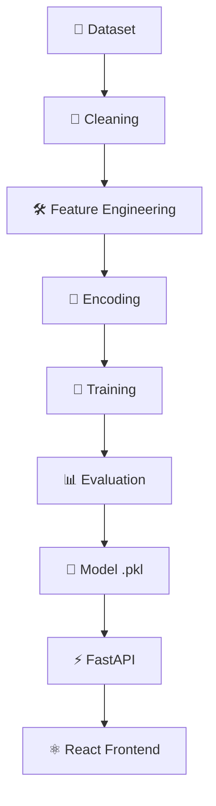

<div align="center">

# StayWise AI

### AI-Powered Airbnb Price Prediction Platform

Predict Airbnb listing prices instantly using a machine learning engine built on XGBoost regression — delivered through a fast, modern full-stack application.

<br />

[](https://www.python.org/)
[](https://fastapi.tiangolo.com/)
[](https://react.dev/)
[](https://vitejs.dev/)
[](https://tailwindcss.com/)
[](https://www.framer.com/motion/)
[](https://xgboost.readthedocs.io/)
[](https://www.sqlite.org/)

<br />

[](#license)
[](#contributing)
[](#tech-stack)
[](#tech-stack)
[](#)

<br />

</div>

---
## About The Project

**StayWise AI** is a full-stack machine learning application that predicts Airbnb listing prices using an XGBoost regression model trained on real-world listing data.

Pricing an Airbnb property is harder than it looks. Hosts have to weigh location, room type, availability, amenities, and dozens of other variables — usually without any reliable way to know what those factors are actually worth in the current market. Most end up relying on guesswork or copying nearby listings, which leads to underpricing, lost bookings, or properties that sit unbooked for weeks.

StayWise AI replaces that guesswork with a model trained specifically to capture these pricing patterns. XGBoost was chosen because it handles the kind of structured, non-linear data found in real estate and rental markets far better than simple rule-based pricing — the model learns directly from historical listings instead of relying on fixed assumptions.

The prediction engine is wrapped in a complete product experience rather than a bare model endpoint. A FastAPI backend serves predictions from the trained model, while a React and Vite frontend — styled with Tailwind CSS and animated with Framer Motion — provides a fast, responsive interface for interacting with it. Every prediction is persisted to a SQLite database, giving users a searchable, filterable history they can export to CSV or clear at any time.

The result is a system that turns a single machine learning model into a usable pricing tool — one that gives hosts, analysts, and platforms a faster, more consistent way to estimate value instead of relying on intuition alone.
## ✨ Project Highlights

<table>
  <tr>
    <td width="50%">
      <h3>🎯 AI-Powered Price Prediction</h3>
      <p>Delivers accurate Airbnb price estimates using a trained XGBoost regression model.</p>
    </td>
    <td width="50%">
      <h3>⚡ FastAPI REST API</h3>
      <p>High-performance backend built with FastAPI for fast, reliable model inference.</p>
    </td>
  </tr>
  <tr>
    <td width="50%">
      <h3>🖥️ React + Vite Frontend</h3>
      <p>Lightning-fast, modern frontend architecture powered by React and Vite.</p>
    </td>
    <td width="50%">
      <h3>🎨 Premium Responsive UI</h3>
      <p>Fully responsive interface designed for a seamless experience across all devices.</p>
    </td>
  </tr>
  <tr>
    <td width="50%">
      <h3>🕘 Prediction History</h3>
      <p>Every prediction is stored, allowing users to revisit past pricing estimates anytime.</p>
    </td>
    <td width="50%">
      <h3>🔍 Search Predictions</h3>
      <p>Quickly locate specific predictions using an intuitive search experience.</p>
    </td>
  </tr>
  <tr>
    <td width="50%">
      <h3>🧮 Advanced Filtering</h3>
      <p>Refine prediction history using flexible, real-time filtering options.</p>
    </td>
    <td width="50%">
      <h3>📤 CSV Export</h3>
      <p>Export prediction history instantly for reporting or offline analysis.</p>
    </td>
  </tr>
  <tr>
    <td width="50%">
      <h3>🗑️ Clear History</h3>
      <p>Remove prediction records individually or clear the entire history in one action.</p>
    </td>
    <td width="50%">
      <h3>🗄️ SQLite Database</h3>
      <p>Lightweight, reliable persistence layer for storing predictions securely.</p>
    </td>
  </tr>
  <tr>
    <td width="50%">
      <h3>🧊 Glassmorphism Interface</h3>
      <p>Modern glass-style UI design that gives the application a premium visual identity.</p>
    </td>
    <td width="50%">
      <h3>🎬 Smooth Motion Animations</h3>
      <p>Fluid, polished transitions powered by Framer Motion for a refined user experience.</p>
    </td>
  </tr>
</table>
## 🛠️ Tech Stack

### Frontend

<div>
  
  
  
  
  
</div>

### Backend

<div>
  
  
</div>

### Machine Learning

<div>
  
  
  
  
</div>

### Database

<div>
  
</div>

### Development Tools

<div>
  
  
  
</div>
## 🏗 Project Architecture

StayWise AI follows a clean, modular full-stack architecture that separates concerns between the presentation layer, API layer, machine learning inference engine, and persistence layer. This design ensures scalability, maintainability, and a clear, unidirectional data flow from user interaction to prediction response.



### How It Works

- **React Frontend** — Captures listing details from the user through a responsive interface and triggers prediction requests.
- **Axios** — Handles communication between the frontend and backend, sending requests and receiving structured JSON responses.
- **FastAPI Backend** — Exposes REST endpoints, validates incoming data, and orchestrates the prediction workflow.
- **XGBoost Model** — Processes the input features and generates a price prediction using a pre-trained regression model.
- **SQLite Database** — Persists each prediction along with its metadata, enabling history retrieval, search, and filtering.
- **Response Flow** — The prediction result is returned through FastAPI to the frontend, where it is rendered instantly for the user.

This architecture keeps the machine learning logic fully decoupled from the UI, allowing the model, API, and frontend to evolve independently while maintaining a fast and reliable prediction pipeline.
## 🧠 Machine Learning Pipeline

The core intelligence of StayWise AI is built on a structured, end-to-end machine learning workflow — from raw listing data to a fully served prediction. Each stage is designed to ensure data quality, model reliability, and consistent inference in production.



### Pipeline Stages

| Stage | Description |
|---|---|
| **Dataset Collection** | Raw Airbnb listing data is gathered, capturing property, location, and pricing attributes. |
| **Data Cleaning** | Missing values, duplicates, and inconsistent records are handled to ensure data integrity. |
| **Feature Engineering** | Relevant features are derived and refined to improve the model's predictive signal. |
| **One-Hot Encoding** | Categorical variables are transformed into numerical representations suitable for training. |
| **Train-Test Split** | The dataset is partitioned to enable unbiased training and objective performance evaluation. |
| **Model Training** | The XGBoost regressor is trained on the processed feature set to learn pricing patterns. |
| **XGBoost Regression** | A gradient-boosted decision tree algorithm optimized for structured, tabular data. |
| **Model Evaluation** | Performance is validated using regression metrics to confirm prediction accuracy. |
| **Model Serialization (.pkl)** | The trained model is exported into a portable format for use in production. |
| **FastAPI Prediction API** | The serialized model is loaded and served through a REST endpoint for real-time inference. |
| **Frontend Prediction** | User input is sent to the API, and the returned prediction is displayed instantly in the UI. |
| **Prediction History (SQLite)** | Each prediction is persisted, enabling retrieval, search, filtering, and export at any time. |
## 📁 Project Structure
StayWise-AI/
│
├── backend/
│ ├── main.py
│ ├── crud.py
│ ├── database.py
│ ├── models.py
│ ├── schemas.py
│ ├── staywise.db
│ ├── model/
│ │ ├── xgboost_model.pkl
│ │ └── feature_columns.pkl
│ └── requirements.txt
│
├── frontend/
│ ├── src/
│ │ ├── components/
│ │ ├── pages/
│ │ ├── api/
│ │ ├── services/
│ │ ├── assets/
│ │ └── App.jsx
│ ├── package.json
│ └── vite.config.js
│
├── dataset/
│ └── AB_NYC_2019.csv
│
├── README.md
└── LICENSE
### Directory Overview

| Folder/File | Purpose |
|---|---|
| `backend/` | Contains the FastAPI application, including API routes, database logic, and the trained ML model. |
| `backend/main.py` | Entry point for the FastAPI server; defines and registers all API endpoints. |
| `backend/crud.py` | Handles create, read, update, and delete operations for prediction records. |
| `backend/database.py` | Configures the SQLite database connection and session management. |
| `backend/models.py` | Defines SQLAlchemy ORM models representing database tables. |
| `backend/schemas.py` | Defines Pydantic schemas for request validation and response serialization. |
| `backend/staywise.db` | SQLite database file storing all prediction history. |
| `backend/model/` | Stores the serialized machine learning model and its associated feature columns. |
| `backend/model/xgboost_model.pkl` | Pre-trained XGBoost regression model used for generating price predictions. |
| `backend/model/feature_columns.pkl` | Stores the exact feature column order required for consistent model inference. |
| `backend/requirements.txt` | Lists all Python dependencies required to run the backend service. |
| `frontend/` | Contains the React and Vite-based client application. |
| `frontend/src/components/` | Reusable UI components used across different pages of the application. |
| `frontend/src/pages/` | Top-level page views such as the prediction form and history dashboard. |
| `frontend/src/api/` | Centralized API request definitions used to communicate with the backend. |
| `frontend/src/services/` | Helper services for handling business logic on the client side. |
| `frontend/src/assets/` | Static assets such as images, icons, and styling resources. |
| `frontend/src/App.jsx` | Root React component that defines application routing and layout. |
| `frontend/package.json` | Defines frontend dependencies, scripts, and project metadata. |
| `frontend/vite.config.js` | Configuration file for the Vite build tool and development server. |
| `dataset/AB_NYC_2019.csv` | Raw Airbnb listing dataset used for training the machine learning model. |
| `README.md` | Primary documentation file describing the project, setup, and usage. |
| `LICENSE` | Contains the project's open-source license terms. |
## 📡 REST API Documentation

StayWise AI exposes a clean, well-structured REST API built with FastAPI, enabling seamless integration between the frontend and the underlying machine learning model.

| Method | Endpoint | Description |
|---|---|---|
| `POST` | `/predict` | Accepts Airbnb listing features and returns the predicted price using the XGBoost model. |
| `GET` | `/history` | Retrieves the complete prediction history stored in the database. |
| `GET` | `/history/search` | Searches, filters, and sorts prediction history based on query parameters. |
| `DELETE` | `/history` | Deletes all stored prediction history records. |

### Example Prediction Request

```json
{
  "latitude": 40.75362,
  "longitude": -73.98377,
  "neighbourhood_group": "Manhattan",
  "neighbourhood": "Midtown",
  "room_type": "Entire home/apt",
  "minimum_nights": 3,
  "number_of_reviews": 45,
  "reviews_per_month": 1.75,
  "calculated_host_listings_count": 2,
  "availability_365": 180,
  "review_year": 2019,
  "review_month": 6
}
```

### Example Response

```json
{
  "predicted_price": 73.31
}
```
# 🚀 Installation & Setup

Follow the steps below to set up **StayWise AI** locally for development or testing.

---

## 1️⃣ Clone Repository

```bash
git clone https://github.com/USERNAME/StayWise-AI.git
cd StayWise-AI
```

---

## 2️⃣ Backend Setup

Navigate to the backend directory and create a virtual environment.

```bash
cd backend
python -m venv venv
```

<details>
<summary>🪟 Activate Virtual Environment — Windows</summary>

```bash
venv\Scripts\activate
```

</details>

<details>
<summary>🐧 Activate Virtual Environment — Linux / macOS</summary>

```bash
source venv/bin/activate
```

</details>

Install the required Python dependencies:

```bash
pip install -r requirements.txt
```

Start the FastAPI backend server:

```bash
uvicorn main:app --reload
```

> ✅ The backend will now be running at:
> **http://127.0.0.1:8000**

---

## 3️⃣ Frontend Setup

In a new terminal, navigate to the frontend directory and install dependencies:

```bash
cd frontend
npm install
npm run dev
```

> ✅ The frontend will now be running at:
> **http://localhost:5173**

---

## 4️⃣ Build for Production

To generate an optimized production build of the frontend:

```bash
npm run build
```

---

## 5️⃣ API Documentation

FastAPI automatically generates interactive API documentation.

| Documentation | URL |
|---|---|
| 📘 Swagger UI | [http://127.0.0.1:8000/docs](http://127.0.0.1:8000/docs) |
| 📗 ReDoc | [http://127.0.0.1:8000/redoc](http://127.0.0.1:8000/redoc) |

---
# 🧠 Machine Learning Pipeline

StayWise AI's prediction engine is built on a structured, reproducible machine learning pipeline — transforming raw Airbnb listing data from `AB_NYC_2019.csv` into a production-ready price prediction service.



---

## ⚙️ Data Preprocessing

The raw dataset undergoes a series of transformation steps to ensure it is clean, consistent, and model-ready:

- ✔ **Missing Value Handling** — Null and incomplete records are identified and appropriately handled to preserve data integrity.
- ✔ **Review Year Extraction** — The year component is extracted from the last review date to capture temporal pricing trends.
- ✔ **Review Month Extraction** — The month component is extracted to account for seasonal variation in pricing.
- ✔ **One-Hot Encoding** — Categorical features such as neighbourhood group and room type are converted into numerical representations.
- ✔ **Numerical Feature Selection** — Relevant numerical fields are selected based on their contribution to pricing behavior.
- ✔ **Feature Alignment with Training Columns** — Incoming data is aligned with the exact feature schema used during training to ensure consistent inference.

---

## 🤖 Model Training

**Algorithm:** XGBoost Regressor

XGBoost was selected for its ability to model complex, non-linear relationships within structured, tabular data — a natural fit for Airbnb pricing, which is influenced by many interacting variables. Its gradient-boosted tree architecture offers strong predictive performance, built-in handling of feature interactions, and robustness against overfitting, making it a reliable choice for real-world regression tasks like price estimation.

---

## 📊 Model Evaluation

| Metric | Purpose |
|---|---|
| **R² Score** | Measures how well the model explains the variance in Airbnb listing prices. *(Project Dependent)* |
| **MAE** | Captures the average absolute difference between predicted and actual prices. *(Project Dependent)* |
| **RMSE** | Penalizes larger prediction errors more heavily, reflecting overall prediction accuracy. *(Project Dependent)* |

---

## 💾 Model Deployment

The trained model is deployed directly within the backend for real-time inference:

- ✔ `model.pkl` — Serialized XGBoost regression model
- ✔ `feature_columns.pkl` — Ensures consistent feature ordering during prediction
- ✔ Loaded directly inside **FastAPI** at application startup
- ✔ Enables **real-time prediction** through the `/predict` endpoint
- ✔ Prediction results are persisted using **SQLite** for history tracking
# 🌟 Future Improvements

StayWise AI is built with a scalable foundation, designed to evolve well beyond its current feature set. The roadmap below outlines the planned trajectory of the platform.

| Version | Planned Feature | Description |
|---|---|---|
| **v2.0** | 🔐 User Authentication | Introduce secure login and signup functionality for personalized user accounts. |
| **v2.1** | 🐘 PostgreSQL Database | Migrate from SQLite to PostgreSQL to support scalable, cloud-based storage. |
| **v2.2** | 📈 Interactive Charts | Add a prediction analytics dashboard with visual trends and insights. |
| **v2.3** | 🧭 AI Recommendation Engine | Provide intelligent pricing suggestions based on historical prediction patterns. |
| **v2.4** | 🖼️ Property Image Upload | Enable image-based analysis to enrich prediction accuracy using visual data. |
| **v2.5** | 🔍 Explainable AI | Visualize feature importance to improve model transparency and trust. |
| **v3.0** | 🧬 Deep Learning Model | Introduce a neural network-based pricing model for enhanced predictive power. |
| **v3.1** | 🌐 Real-Time Market Trends | Integrate live Airbnb market data for up-to-date pricing insights. |
| **v3.2** | 🗺️ Multi-City Prediction | Expand model support to a global, multi-city Airbnb dataset. |
| **v4.0** | 🤖 AI Assistant | Launch a conversational chatbot to guide hosts through pricing decisions. |

---

## 🚀 Long-Term Vision

StayWise AI is designed to grow far beyond a single-model prediction tool into a complete **AI-powered pricing intelligence platform**. The long-term vision is to serve hosts, data analysts, and property management companies with a unified system that combines predictive modeling, real-time market insights, explainable AI, and intelligent recommendations — transforming pricing from a manual, intuition-driven task into a data-backed, strategic decision. As the platform matures, StayWise AI aims to become the pricing infrastructure layer for modern short-term rental businesses, scaling seamlessly from individual hosts to enterprise-level property portfolios. 🌍💡
# 🤝 Contributing

Contributions are what make the open-source community such an incredible place to learn, build, and grow. Any contributions you make are **greatly appreciated**.

---

### 🧭 How to Contribute

**1. 🍴 Fork the Repository**

Click the **Fork** button at the top right of this repository to create your own copy.

**2. 📥 Clone the Repository**

```bash
git clone https://github.com/YOUR-USERNAME/StayWise-AI.git
cd StayWise-AI
```

**3. 🌿 Create a Feature Branch**

```bash
git checkout -b feature/new-feature
```

**4. 💾 Commit Your Changes**

```bash
git commit -m "Add new feature"
```

**5. 🚀 Push to Your Branch**

```bash
git push origin feature/new-feature
```

**6. 🔁 Open a Pull Request**

Navigate to the original repository and open a **Pull Request**, describing the changes you've made and why they add value to the project.

---

### 💡 A Note to Contributors

Whether you're fixing a bug, improving documentation, optimizing the machine learning pipeline, or proposing an entirely new feature — your contribution matters. StayWise AI is built to grow with its community, and every pull request, issue, and suggestion helps shape it into a stronger, more capable project. Thank you for taking the time to contribute — we're glad to have you here. 🌟
# 📜 License

[](LICENSE)

This project is licensed under the **MIT License** — one of the most permissive and widely adopted open-source licenses available.

The MIT License allows anyone to freely use, copy, modify, merge, publish, distribute, sublicense, and even sell copies of this software, provided that the original copyright notice and license text are included in all copies or substantial portions of the software.

You're welcome to build upon **StayWise AI**, adapt it for your own projects, or use it as a foundation for something greater — a simple credit to the original work is always appreciated. 🌟

See the [LICENSE](LICENSE) file for full details.
# 👨‍💻 About the Developer

**Ayush Palse** is a Machine Learning enthusiast and Full Stack AI developer with a strong curiosity for building practical, real-world AI applications. With a growing focus on Data Science, XGBoost, and modern web technologies like FastAPI and React, Ayush enjoys bridging the gap between machine learning models and usable, production-style applications.

Driven by continuous learning rather than claimed expertise, Ayush approaches every project as an opportunity to deepen his understanding of AI systems, backend architecture, and frontend engineering — with a clear focus on solving meaningful problems through technology rather than building for the sake of complexity.

StayWise AI reflects this mindset: a hands-on exploration of how machine learning, APIs, and modern UI design can come together to create something genuinely useful.

---

## 🌐 Connect With Me

[](YOUR_GITHUB)
[](YOUR_LINKEDIN)
[](mailto:YOUR_EMAIL)
[](YOUR_PORTFOLIO)

---

## ⭐ Support

If you found this project valuable or interesting, consider showing some support:

⭐ **Star** the repository to help others discover it
🍴 **Fork** the project and experiment with your own ideas
💬 **Share feedback** — suggestions and discussions are always welcome

Every bit of support helps StayWise AI grow and improve. 🚀

---

<p align="center">
Built with ❤️ using React • FastAPI • XGBoost
<br />
<em>"Turning Data into Intelligent Decisions."</em>
</p>

